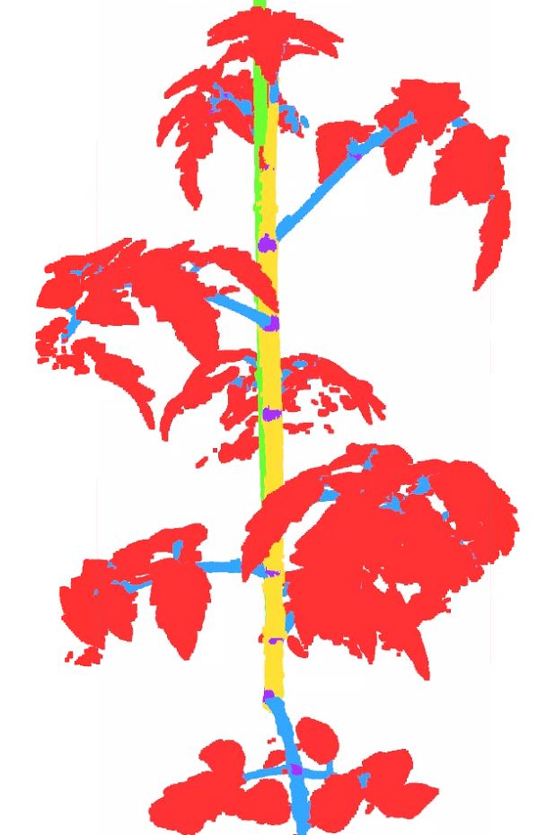

<!-- Data and code that this test set is based upon can be found at [LAST-Straw](https://lcas.github.io/LAST-Straw/) -->
# PREVIEW GIT  
Offical preview of the paper: 

3D plant segmentation: comparing a 2D-to-3D segmentation method with state-of-the-art 3D segmentation algorithms

**Git will be updated after acceptance**


# 3D tomato dataset
IMPROTANT: The dataset is not yet available, since the paper is not yet publised.

This repo contains two items. 
1. A basic data class that can be used to visualize the 3D tomato dataset. The class is based upon Pytorch's Dataset class and can therefore be used within Pytorch's dataloader used for training models for machine learning-> run python wurTomato.py/
The visualisation uses [Open3D](https://www.open3d.org/) 
2. An example how to apply the 2D-to-3D reprojection method assuming that you already have segmented the images using Mask2Former for example
3. An example to use the dataset to train a 3D semantic segmentation algorithm using the pointcept git.  

<center>
    <p align="center">
        
        
    </p>
</center>

## Installation

Note visualisation does not work for devcontainer. 

We use a devcontainer to create the environment.
Make sure your docker environment containts the nvidia docker to get acces to your gpu. 

```
git clone https://github.com/WUR-ABE/2D-to-3D_segmentation
```


## Download and view dataset
This will download the dataset. If everything is correct a folder 3DTomatoDataset will be created.
If not, then download the dataset by hand using following [link](https://filesender.surf.nl/?s=download&token=a5b7382f-28f5-4619-887e-8ed26db65051]). Create a folder named 3DTomatoDataset, and unzip results overhere.

```
python wurTomato.py --visualise 0
# should result in following dataset structure
#3DTomatoDatasets
#└── 20240607_summerschool_csv
#    ├── annotations
#    ├── images
#    ├── test.json
#    ├── train.json
#    └── val.json
```
Also other properties can be visualized like the semantic segmentation, , or for example output of 2Dto3D and PTv3 method.
```
python wurTomato.py --visualise_semantic 0
python wurTomato.py --visualise_output_2dto3d Harvest_02_PotNr_27
python wurTomato.py --visualise_output_3d Harvest_02_PotNr_27
python wurTomato.py --evaluation Harvest_02_PotNr_27

```

## Run 2D-to-3D reprojection
Following line will run the 2D to 3D reprojection method:
```
python wurTomato.py --convert2Dto3D
```


## Voxel-carving / shape-from-silhouette
In the paper the 3D point clouds are made using the MaxiMarvin setup in NPEC (Wageningen University and Research).
The code for the MaxiMarvin is not available. However, to test the proof of concept please run the following script:

```
python BARTUPDATE
```


## Training a PointCept:
Training a semantic segmenation algorithm is done using the json in the dataset folder. See example below.

```
train.sh
```

## Inference Pointcept
This will run the algorithm with pt3 from paper. Saves the prediction in a npy file in the save_path + result folder.

```
python Pointcept/tools/test.py --config-file example_configs/semseg-pt-v3m1-0-base.py --num-gpus 1 --options weight=example_configs/20240516_2022_ptv3_pretrained_default_lr_model_best.pth save_path=example_data/output_ptv3/

```


## Acknowledgement
This github would not be possible without open acces of several important libraries. Many credits to those librabies.

- Pointcept:              https://github.com/Pointcept/Pointcept
- Swin3D:                 https://github.com/microsoft/Swin3D